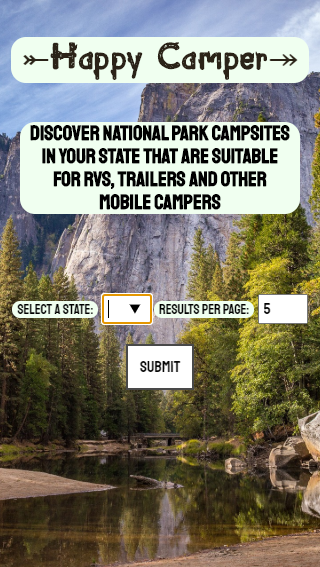
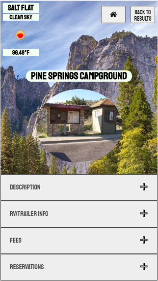

<!-- # Happy Camper

Initial wireframes:

https://balsamiq.cloud/slzzg5o/pvz4s3i/r1043

-->
# Happy Camper

An application designed to help those that are living and traveling on the move. Users can search for a list of National Parks and affiliated campgrounds in their state to see which locations are suitable for RVs/trailers and other mobile campers.

## Motivation

My wife and I have talked about living in a tiny home on wheels for almost a year now. I wanted to attempt the creation of a centralized resource that would give us (and others) information about places where we could park or stay if we ever were to have a mobile tiny home and/or RV setup. 

## Screenshots
Landing Page:

Park/Camp Selection:

Park/Camp Detail:

## Built With

### Front-End
* HTML5
* CSS3
* Javascript
* JQuery

### APIs
* [National Park Services Data API](https://www.nps.gov/subjects/developer/api-documentation.htm#/campgrounds)
* [OpenWeather - Current Weather API](https://openweathermap.org/current)

## Features

* Search for National Parks & campgrounds by state
* Find pertinent information on specific RV/trailer/mobile camper limitations of each park (i.e. size restrictions)
* Find information about park/campground fees
* Find information about reservation policies of specific parks/campgrounds
* See current weather in the area where the park/campground is located to make informed travel decisions

## Future Implementations/Tentative Additions

* Integrate separate API call to create a "Get Directions" button on the Display Detail Page
* Integrate camp/park amenities information from the NPS API into Park/Camp Detail screen

## Github Pages/Live Demo

- [Live Demo](https://amgauthier1992.github.io/happycamper/)

## Authors

* **Andy Gauthier** 

## Acknowledgments

* **Alfredo Salazar** - The Wise Sage
